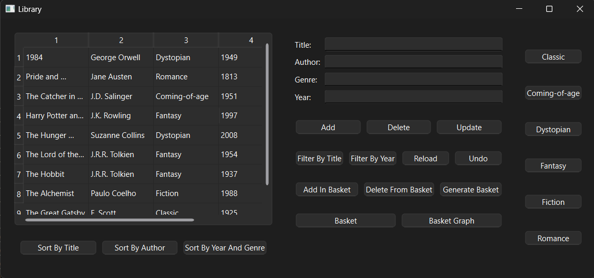
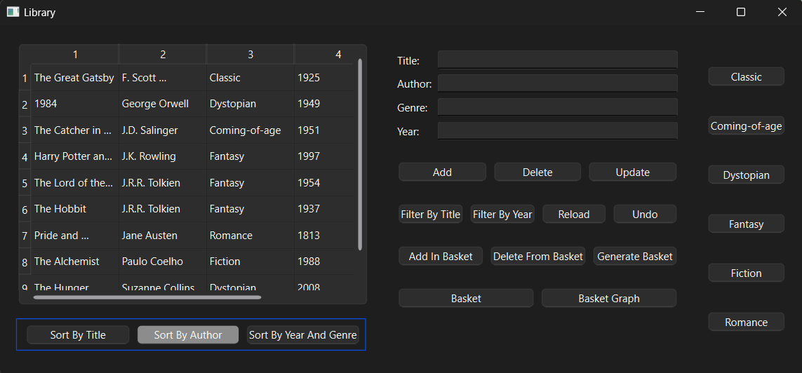
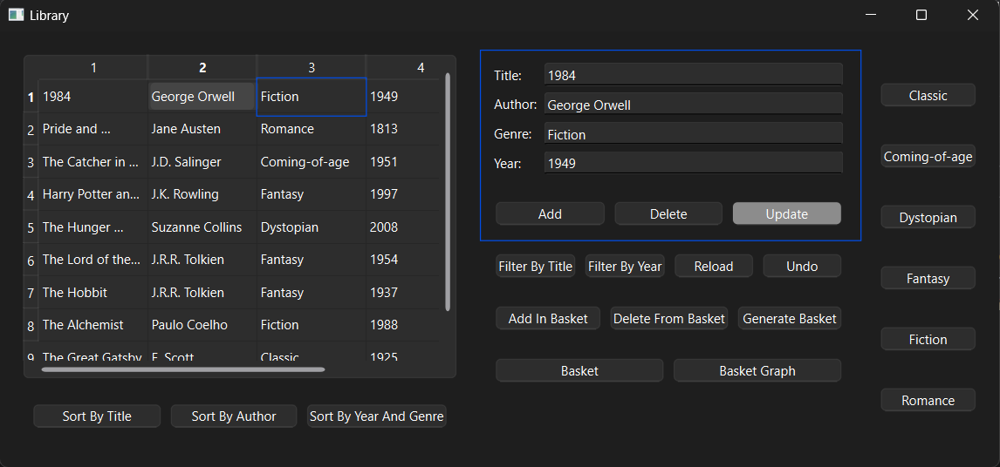
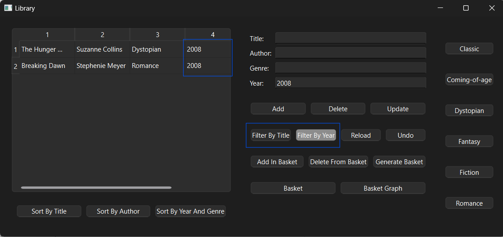
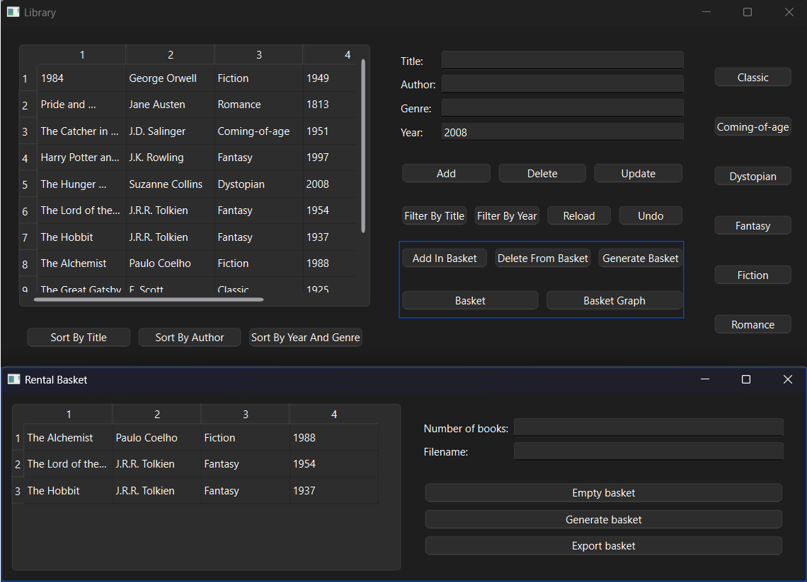
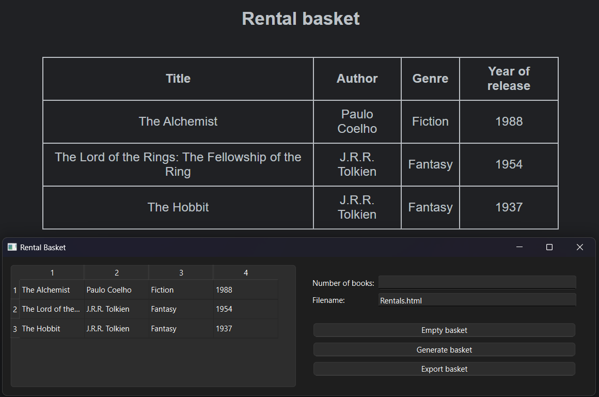

# Library

As part of my Object-Oriented Programming course project at the faculty, I developed a C++ application using Qt for the GUI, focused on library management. This project not only enhanced my understanding of OOP principles, memory management, and design patterns like Observer and MVC but also provided practical experience in handling memory efficiently, including the effective use of pointers and applying the Rule of Three and Rule of Five.

<b>The UI of the app:</b>

<b>The list of books can be sorted by title, by author or by year and genre:</b>

<b>We can add, delete or update books:</b>

<b>We can filter the books by title or by year:</b>

<b>Books can be rented by using the basket. We can add/delete books in/from the basket or generate a basket with some random books:</b>

<b>In the Rental Basket window we can see the rented books, empty the basket, generate a basket or export the basket into an html file:</b>

